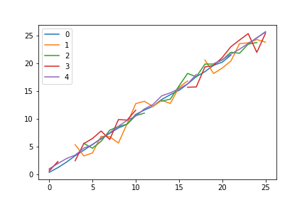
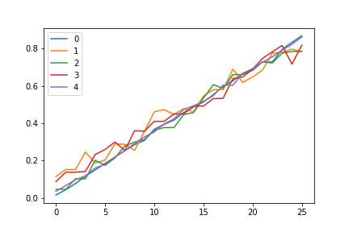
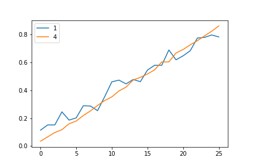
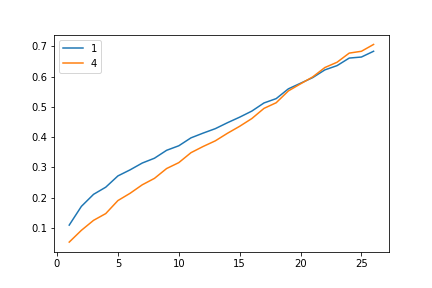

<!-- These are examples of badges you might want to add to your README:
     please update the URLs accordingly

[](https://cirrus-ci.com/github/<USER>/clairvoyance2)
[](https://clairvoyance2.readthedocs.io/en/stable/)
[](https://coveralls.io/r/<USER>/clairvoyance2)
[](https://pypi.org/project/clairvoyance2/)
[](https://anaconda.org/conda-forge/clairvoyance2)
[](https://pepy.tech/project/clairvoyance2)
[](https://twitter.com/clairvoyance2)
-->

[](https://pyscaffold.org/)


# clairvoyance2

> clairvoyance2: a Unified Toolkit for Medical Time Series

**⚠️ The library is in development / very early testing.**

**clairvoyance2** is a library that unifies time series tasks for the medicine and healthcare use case.  It provides tools for manipulating multi-dimensional time series, as well as static data, and implements models for: time series prediction, individualized treatment effects estimation (*upcoming*), time-to-event analysis (*upcoming*), and model interpretability (*upcoming*).  **clairvoyance2** is primarily focussed on machine learning (ML) models.


## Installation

`TBC`


## Example Usage

#### 1\. Get an example dataset.
```python
from clairvoyance2.datasets import dummy_dataset

data = dummy_dataset(
    n_samples = 100,
    temporal_covariates_n_features = 5,
    temporal_covariates_max_len = 30,
    temporal_covariates_missing_prob = 0.1,
    static_covariates_n_features = 4,
    static_covariates_missing_prob = 0.0
)
```

Dataset components (temporal and static covariates) can be seen with their corresponding feature dimensions listed.
```
Dataset(
    temporal_covariates=TimeSeriesSamples([100,*,5]),
    static_covariates=StaticSamples([100,4]),
)
```

Preview temporal covariates for sample `0`.
```python
data.temporal_covariates[0]
```
```
          0         1         2         3         4
0  0.419045  0.893763  0.780285  0.660508  1.047522
1  1.257931  2.172271       NaN  2.360713  1.981578
2  2.247657       NaN  2.525946       NaN  2.897191
3  3.396456  5.386071       NaN  2.503248  3.517212
4  4.387812  3.365264  5.612532  5.573375  4.767746
...
```

```python
data.temporal_covariates[0].plot()
```


#### 2\. Pre-process your data.

**Note:**
* `TC` stands for temporal covariates.
* `TS` stands for time series.

There is missing data, so initialize an imputer.
```python
from clairvoyance2.imputation import DefaultImputerTC
imputer = DefaultImputerTC()
```
```
DefaultImputerTC(
    params={}
)
```

Scale the time series data to `(0, 1)` range.
```python
from clairvoyance2.preprocessing import MinMaxScalerTC
scaler = MinMaxScalerTC()
```
```
MinMaxScalerTC(
    params={'clip': False, 'copy': True, 'feature_range': (0, 1)}
)
```

Transform your data.
```python
data = imputer.fit_transform(data)
data = scaler.fit_transform(data)

data.temporal_covariates[0].plot()
```


#### 3\. Do N-step ahead prediction.

First split out some of the temporal covariate features (labelled `[1, 4]`) as targets. Features `[0, 1, 2]` will then be used as covariates for prediction.
```python
from clairvoyance2.preprocessing import ExtractTargetsTS
data = ExtractTargetsTS(params=dict(targets=[1, 4])).fit_transform(data)
data.temporal_targets[0].plot()
```
```
Dataset(
    temporal_covariates=TimeSeriesSamples([100,*,3]),
    static_covariates=StaticSamples([100,4]),
    temporal_targets=TimeSeriesSamples([100,*,2]),
)
```


Define a prediction model.
```python
from clairvoyance2.prediction.recurrent import RecurrentPredictor
predictor = RecurrentPredictor(params=dict(epochs=5))
```
```
RecurrentPredictor(
    params={   'batch_size': 32,
               'bias': True,
               'bidirectional': False,
               'device_str': 'cpu',
               'dropout': 0.0,
               'epochs': 5,
               'hidden_size': 100,
               'max_len': None,
               'nonlinearity': None,
               'num_layers': 1,
               'optimizer_kwargs': {'lr': 0.01},
               'optimizer_str': 'Adam',
               'proj_size': 1,
               'rnn_model_str': 'LSTM'}
)
```

Choose number of N-steps ahead, here `1`, and fit the model.
```python
from clairvoyance2 import NStepAheadHorizon
predictor.fit(data, horizon=NStepAheadHorizon(1))
```
```
Epoch: 0, Loss: 0.25259913221001623
Epoch: 1, Loss: 0.12435722023248673
Epoch: 2, Loss: 0.07908223867416382
Epoch: 3, Loss: 0.07841305874288082
Epoch: 4, Loss: 0.06723848707973958
```

Then make predictions.
```python
data_predicted = predictor.predict(data=data, horizon=NStepAheadHorizon(1))
data_predicted.temporal_targets[0].plot()
```


Finally, evaluate the results using a metric of choice.
```python
from clairvoyance2.metrics import rmse_temporal_targets
metric = rmse_temporal_targets(data, data_predicted)
print(f"RMSE = {metric:.3f}")
```
```
RMSE = 0.080
```
